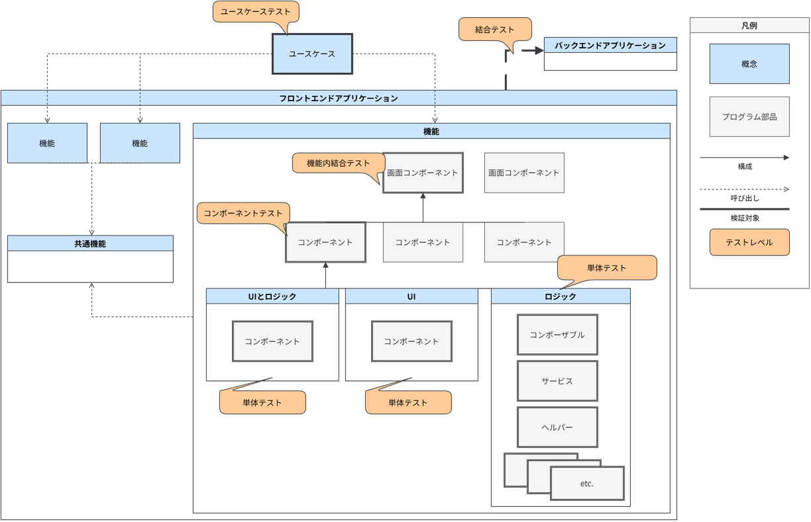
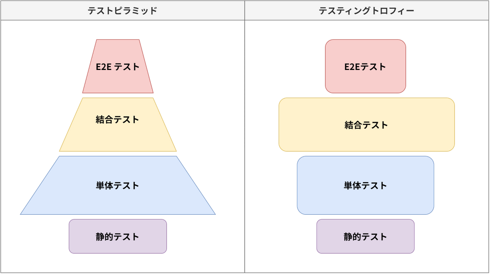

<!-- cspell:ignore Dodds -->
# フロントエンドアプリケーションのテスト {#top}

フロントエンドアプリケーションのテスト方針について解説します。
AlesInfiny Maia OSS Edition では、継続的インテグレーションを目的として、静的テストから E2E テストの一部までを自動化し、品質と開発スピードの両立を目指します。
自動テストが可能なテストレベルのみを扱い、システムテストや受け入れテストといったテストレベルについては扱いません。

## テストを自動化する理由 {#continuous-integration}

[継続的インテグレーション :material-open-in-new:](https://developer.mozilla.org/en-US/docs/Glossary/Continuous_integration){ target=_blank }とは、変更をコードベースに頻繁に統合し、そのたびに自動ビルド・自動テストで検証するソフトウェア開発スタイルです。
継続的インテグレーションを実行する目的は、より短い期間でより多くの機能を本番環境へリリースすることです。
一方で、頻繁なコードベースへの変更には、既存の機能に対するリグレッションのリスクが伴います。
このようなリスクを軽減し、品質を保証したうえで継続的インテグレーションを実現するためには、品質の保証に十分な数の自動テストを継続的にメンテナンスする必要があります。以降で紹介するテストは、開発者のローカル環境および、 GitHub や Azure DevOps のような CI/CD 環境で自動実行できるようにします。コードベースへ変更を加える前にこれらの自動テストを実行することによって、リグレッションのリスクの低減とリリーススピードの両立を実現します。

## テスト対象の構造 {#test-target-structure}

何をテストするのかを整理するために、まずフロントエンドアプリケーションの構造を確認します。
下記はフロントエンドアプリケーションのテストに着目したシステムの模式図です。
システムの構成要素、プログラム部品、検証対象、テストの名称を示します。

{ width="800" loading=lazy }

上図で用いた用語の意味を表に示します。

| 名称         | 意味                                                                                                     | 例                                                     |
| ------------ | -------------------------------------------------------------------------------------------------------- | ------------------------------------------------------ |
| ユースケース | 利用者目線で記述したシステムの利用シナリオで、機能を組み合わせて実現します。                             | 商品を購入する。                                       |
| 機能         | 利用者に対してシステムが提供する個々の能力です。コンポーネントとコンポーザブルを組み合わせて実現します。 | 商品一覧機能、買い物かご機能、注文機能。               |
| 共通機能     | 機能のうち、様々な機能から呼び出される機能横断的な機能です。                                             | ログ出力機能、例外処理機能。                           |
| UI           | 見た目を実装する部品の総称です。                                                                         | ボタン、ツールチップ、トースト、テーブル。             |
| ロジック     | 業務ルールを実装する部品の総称です。                                                                     | 計算処理、フォームバリデーション、表示用の文字列加工。 |

コンポーネント志向のフロントエンドアプリケーションでは、コンポーネントを組み合わせて機能を実現します。
コンポーネントは、 UI またはロジックまたは別のコンポーネントの組み合わせによって構成される部品です。
そのため、典型的なコンポーネントは UI とロジックを持ちますが、 UI のみのコンポーネントや、ロジックのみのコンポーネントも存在しえます。
コンポーネントを組み合わせて画面コンポーネントを実装し、利用者は画面コンポーネントを通じて機能を呼び出すことで、ユースケースを実現します。
詳細については [フロントエンドアーキテクチャ](../../frontend-application/index.md) を参照してください。

## テストの種類 {#test-types}

上記の構造のどこを検証するかによって、テストを 6 種類に分けます。
[テストレベル](../index.md#test-level) とテストの名称、検証対象を表に示します。

| テストレベル       | 名称                 | 検証対象                                                                     |
| ------------------ | :------------------- | :--------------------------------------------------------------------------- |
| 単体テスト ( UT0 ) | 静的テスト           | ソースコード（不具合の原因となる記述や規約違反を検出）                       |
| 単体テスト ( UT0 ) | 単体テスト           | モジュール単位のロジック                                                     |
| 単体テスト ( UT0 ) | コンポーネントテスト | UI・ロジック・コンポーネント間の結合によるコンポーネントの実現               |
| 単体テスト ( UT0 ) | 機能内結合テスト     | コンポーネントの結合による機能の実現                                         |
| 単体テスト ( UT0 ) | ユースケーステスト   | 機能間の結合によるユースケースの実現                                         |
| 結合テスト ( ITa ) | E2E テスト           | フロントエンド・バックエンドアプリケーション間の結合によるユースケースの実現 |

いずれも自動テストとして実装します。
以降、この並び順を下位から上位への順序として扱います。

## テスト戦略 {#test-strategy}

### テスト戦略のモデル {#test-strategy-model}

<!-- textlint-disable ja-technical-writing/sentence-length -->

テスト戦略の代表的なモデルとして、[テストピラミッド :material-open-in-new:](https://web.dev/articles/ta-strategies?hl=ja#the_classic_the_test_pyramid){ target=_blank }が挙げられます。
テストピラミッドは単体テストを厚くし、結合テストや E2E テストを少数に絞るモデルであり、各テストの量を種類別に積み上げると、下図のようにピラミッド状の三角形を形成します。

一方で、フロントエンドアプリケーションのテストの文脈でよく挙げられるモデルが、[テスティングトロフィー :material-open-in-new:](https://web.dev/articles/ta-strategies?hl=ja#testing_trophy){ target=_blank }です。
テスティングトロフィーは、[React Testing Library :material-open-in-new:](https://github.com/testing-library/react-testing-library){ target=_blank }の開発者として知られる [Kent C. Dodds :material-open-in-new:](https://kentcdodds.com/){ target=_blank }により提唱された、単体テストよりも結合テストを重視するモデルです。上記の表に当てはめると、機能内結合テストやユースケーステストが単体テストよりも重視されます。このことにより、同様に積み上げた場合に下図のように中腹部が膨らんだトロフィー状の形を形成します。

<!-- textlint-enable ja-technical-writing/sentence-length -->

{ width="800" loading=lazy }

toC 向け Web サービスでは、 ユーザー体験の良し悪しが競争力の源泉となる傾向にあるので、ユーザーインタラクションに関する機能とその品質を重視する必要があります。
このことにより、フロントエンドアプリケーションを構成するコードのうち、 UI に関するコードのほうがロジックに関するコードよりも多くを占める傾向性があると考えられます。

一方で、基幹システムのようなエンタープライズ向け業務アプリケーションでは、 ユーザーの利便性よりもデータの整合性や権限管理が重要視される傾向にあると考えられます。そのため、フォームの入力値検証などの業務ロジックをフロントエンドアプリケーションにも厚く実装する必要があります。
よって、 ロジックに関するコードの比率が toC 向け Web サービスと比較して多くなると考えられます。

そのため、エンタープライズ向け業務アプリケーションの領域では、たとえフロントエンドアプリケーションであっても、単体テストを重視するテストピラミッド戦略のほうが、現実を反映した適切なモデルになりやすいと考えられます。

??? warning "テスト戦略のアンチパターン"
    E2E テストおよび手動テストに過度に依存したテスト戦略は、テストがリリースのボトルネックになる状況へ陥りやすいため、避けるべきです。
    E2E テストは、フロントエンドアプリケーションとバックエンドアプリケーションを実際に連携させ、ユーザー操作に近い形で機能を検証できるメリットがあります。
    しかし、画面操作、通信、データベース更新などを含むため、単体テストや結合テストと比べて実行に物理的な時間を要します。
    また、テスト環境、外部サービス、テストデータの状態などの影響を受けやすく、エラー原因の切り分けにも時間がかかります。
    手動テストも、実際の利用者に近い観点で確認できる一方、機能追加や修正の都度広範囲の回帰検証を手動で実行することは難しく、変更の影響を十分に確認できないままリリースせざるを得ない状況を招きます。
    その結果、 E2E テストや手動テストへの依存度が高いほど、リリース前の検証作業が肥大化し、リリース頻度を下げるボトルネックになります。
    アプリケーションの規模が大きく、運用期間が長くなるほど、テストがボトルネックとなるリスクは高くなると考えられます。

??? note "エンタープライズ向けアプリケーションのテスト戦略"
    大規模システムの開発では、小規模システムと比較して、組織境界をまたいだテストが指数関数的に高コストになる傾向があると想定されます。
    そのため、システム全体の構成要素となるサブシステムや、サブシステムを構成する機能は、できるだけ組織の境界をまたがないようにデザインされる傾向にあります。
    よって、大規模なエンタープライズ向けアプリケーションのテスト戦略も、できるだけ組織に閉じた形で実装・実行可能になるよう策定するほうが運用上有利だと考えられます。

    テスト戦略を選択するうえで、テスト工程の実行スピードが機能リリースのボトルネックになるかどうかは重要です。
    ミッションクリティカルでない領域の Web サービスや SaaS 、社内ツールといったアプリケーションはリリースの頻度が高くなる傾向になるため、自動テストを用いて回帰検証の時間の短縮を必要とします。
    逆に、公共・金融などといったミッションクリティカルな業務領域のアプリケーションはリリースの頻度が低くなる傾向にあるので、自動テストがボトルネックとなる可能性も低くなります。

### 各テストの配分 {#test-allocation}

テストピラミッドに沿って、各テストの量を次のように配分します。
下位のテストで検証できることは下位のテストで検証し、上位のテストでは下位のテストで確認済みの仕様を検証し直しません。

- **単体テスト**：ロジックを持つモジュールをすべて対象とし、分岐を網羅します。テストケースの大半をこの層に置きます。
- **コンポーネントテスト**：単体テストでは検証できない、描画結果とユーザー操作に対する振る舞いに絞ります。
- **機能内結合テスト**：コンポーネントを結合しなければ確認できない、コンポーネント間のデータの受け渡しに絞ります。
- **ユースケーステスト**：ユースケースごとに、代表的な流れを対象とします。
- **E2E テスト**：[結合テスト ( ITa ) のテスト対象](integration-test.md#testing-targets) で述べる 2 種類のユースケースに限定します。

## 各テストの詳細 {#test-details}

上記のテストを、テストレベルごとに以下のページで解説します。

1. [単体テスト ( UT0 )](unit-test.md)

    主に以下のテストを行います。

    - Prettier や ESLint などを用いた、ソースコード内の潜在的な不具合を検出する静的テスト
    - Vitest 、 Vue Test Utils を用いた、ロジックやコンポーネントから、それらを結合して実現する機能やユースケースまでの機能性を確認する動的テスト

1. [結合テスト ( ITa )](integration-test.md)

    主に以下のテストを行います。

    - Playwright を用いた、フロントエンドアプリケーションからバックエンドアプリケーションまで一気通貫で機能性を確認する E2E テスト
