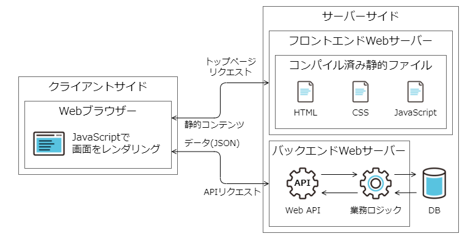
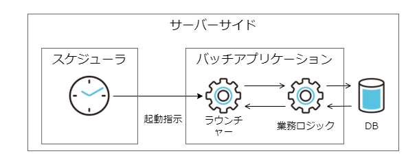

# 構築できるアプリケーション形態

Maia OSS 版を利用することで構築できるアプリケーションの概要を、アプリケーション形態ごとに説明します。

- Web アプリケーション（クライアントサイドレンダリング）

    HTML をクライアント側 JavaScript でレンダリングする方式の Web アプリケーションです。
    画面初期表示時にはコンパイル済みの静的ファイルをダウンロードして、 JavaScript で動的に画面をレンダリングします。
    業務データの取得、更新などの処理を行う際は、 Web API 経由でサーバー側の業務ロジックを呼び出します。

    

- Web アプリケーション（サーバーサイドサイドレンダリング）

    サーバーサイドで構築した HTML を表示する方式の Web アプリケーションです。
    （今後追加予定）

- バッチアプリケーション

    バッチ処理を実装したJavaアプリケーションです。
    スケジューラや手動で起動し、Webアプリケーションとは独立して業務処理を実行します。

    

--8<-- "includes/abbreviations.md"