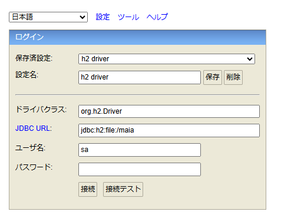

<!-- cSpell:ignore configfile taskdef -->

# MyBatis Generator の設定 {#top}

infrastructure プロジェクトにおいて、 MyBatis Generator を利用してテーブルエンティティやマッパーインターフェース、 SQL マッピングファイルを自動的に生成するための設定について解説します。

## 事前準備 {#preparation}

本手順を実行する前に [infrastructure プロジェクトの設定](./infrastructure-project-settings.md) を完了してください。

MyBatis Generator を実行する際は、生成対象となるテーブルが作成されたデータベースを稼働させる必要があります。
本設定では [H2 Console :material-open-in-new:](https://www.h2database.com/html/download.html){ target=_blank } を利用して H2 Database に以下の DDL と DML を実行し、テーブルを作成しています。

??? example "サンプルアプリケーションの schema.sql"

    ```sql title="schema.sql"
    https://github.com/AlesInfiny/maia/blob/main/samples/web-csr/dressca-backend/infrastructure/src/main/resources/schema.sql
    ```

??? example "サンプルアプリケーションの data.sql"

    ```sql title="data.sql"
    https://github.com/AlesInfiny/maia/blob/main/samples/web-csr/dressca-backend/infrastructure/src/main/resources/data.sql
    ```

!!! warning "MyBatis Generator 実行用のテーブル作成について"

    サンプルアプリケーションの実行中は、 schema.sql と data.sql が自動的に読み込まれた H2 Database がインメモリで起動します。
    そのため、サンプルアプリケーションの実行用のデータベース作成の必要はありませんが、アプリケーションの停止と共にテーブルは削除されます。

    よって、 MyBatis Generator を利用する際には、自動生成用のテーブルを別途用意しておく必要があります。
    H2 Console を利用してデータベースを起動する場合は、以下の手順を実施します。

    1. [H2 Console :material-open-in-new:](https://www.h2database.com/html/download.html){ target=_blank } をインストールする。
    1. Windows 内を検索し、 H2 Console を起動する。
    1. JDBC URL に任意のパスを入力し、接続ボタンをクリックする。接続すると自動でデータベースが作成され、起動する。

        

    1. 上記の方法でエラーが発生する場合は、 H2 Console のインジケーターを右クリックし `Create new database ...` を選択する。

        

    1. 任意のパス、ユーザー名、パスワードでデータベースを作成する。

        

    1. 2 の手順と同様に先ほどのパス、ユーザー名、パスワードを入力して接続し、データベースを起動する。

## MyBatis Generator の設定ファイルの作成 {#generator-files-settings}

infrastructure プロジェクトの src/main/resource フォルダーに設定ファイルである mybatisGeneratorConfig.xml を追加します。
mybatisGeneratorConfig.xml に設定する各要素については、[こちら :material-open-in-new:](https://mybatis.org/generator/configreference/xmlconfig.html){ target=_blank } を参照してください。

サンプルアプリケーションにおける設定例は以下の通りです。

??? example "サンプルアプリケーションの mybatisGeneratorConfig.xml"

    ```xml title="mybatisGeneratorConfig.xml"
    https://github.com/AlesInfiny/maia/blob/main/samples/web-csr/dressca-backend/infrastructure/src/main/resources/mybatisGeneratorConfig.xml
    ```

    各タブの設定内容は以下の通りです。

    - `<jdbcConnection>`: 接続するデータベースに関する設定です。
    - `<javaModelGenerator>`: データベースのテーブルに対応する Java のテーブルエンティティクラスを生成するための設定です。
    - `<sqlMapGenerator>`: MyBatis の SQL マッピングファイルを生成するための設定です。
    - `<javaClientGenerator>`: MyBatis のマッパーインターフェースを生成するための設定です。
    - `<table>`: 生成対象となるテーブルに関する設定です。

    なお、`<jdbcConnection>` の `driverClass` や `connectionURL` は使用するデータベースに合わせて変更してください。
    また、`<javaModelGenerator>` や `<sqlMapGenerator>` 等の `targetPackage` や `targetProject` の設定はフォルダー構成に合わせて修正してください。

次に、 `<javaClientGenerator>` や `<sqlMapGenerator>` で生成される XML ファイルをリソースに指定する設定を infrastructure プロジェクトの build.gradle に記述します。

```groovy title="build.gradle"
sourceSets {
  main {
    // mybatis SQL map XML ファイルを java 以下でも検知する
    resources.srcDirs = ["src/main/java", "src/main/resources"]
  }
}
```

## 依存ライブラリの設定 {#config-dependencies}

infrastructure プロジェクトの build.gradle の configurations に MyBatis Generator 実行用の依存関係のカスタム構成を定義します。

```groovy title="build.gradle"
configurations {
  // MyBatis Generator の自動生成で利用するライブラリのための依存関係の構成を定義
  mybatisTasks
}
```

次に、 build.gradle の dependencies に以下のような MyBatis Generator を利用するための依存関係を追加します。

- `mybatis-generator-core`：MyBatis Generator のタスクを実行するためのライブラリ
- `h2`：コードの自動生成で利用する組み込みの H2 データベース

この際、依存関係は前述の configurations で定義したカスタム構成である mybatisTasks を利用します。

```groovy title="build.gradle"
dependencies {
  mybatisTasks "org.mybatis.generator:mybatis-generator-core:x.x.x"
  mybatisTasks "com.h2database:h2"
}
```

## 自動生成タスクの追加 {#adding-generation-tasks}

MyBatis Generator を実行するタスク runMyBatisGenerator を定義します。
configfile には、[前述](#generator-files-settings) の mybatisGeneratorConfig.xml のパスを設定します。

```groovy title="build.gradle"
tasks.register('runMyBatisGenerator') {
  doLast {
    // MyBatis Generator のタスクを定義します。
    ant.taskdef(
      name: 'mybatisGenerator',
      classname: 'org.mybatis.generator.ant.GeneratorAntTask',
      classpath: configurations.mybatisTasks.asPath
    )
    // MyBatis Generator による自動生成を実行します。
    ant.mybatisGenerator(
      overwrite: true,
      configfile: file('src/main/resources/mybatisGeneratorConfig.xml'),
      verbose: true
    )
  }
}
```

## 自動生成タスクの実行 {#execution-of-generation-tasks}

ここまでを実行した後に、適切にビルドが実行できるかを確認します。
ターミナルを用いてルートプロジェクト直下で以下を実行してください。

```shell title="自動生成タスクの実行コマンド"
./gradlew infrastructure:runMyBatisGenerator
```

実行後、 mybatisGeneratorConfig.xml の `<javaModelGenerator>` や `<sqlMapGenerator>` 等で設定した配置場所にファイルが自動生成されていることを確認してください。

??? info "ここまでの手順を実行した際の `infrastructure/build.gradle` の例"

    ```groovy title="infrastructure/build.gradle"
    plugins {
      id 'java'
      id 'org.springframework.boot' version 'x.x.x'
      id 'io.spring.dependency-management' version 'x.x.x'
    }

    group = 'プロジェクトのグループ名'
    version = 'x.x.x-SNAPSHOT'
    description = 'プロジェクトの説明'

    java {
      toolchain {
        languageVersion = JavaLanguageVersion.of(x)
      }
    }

    sourceSets {
      main {
        // mybatis SQL map XML ファイルを java 以下でも検知する
        resources.srcDirs = ["src/main/java", "src/main/resources"]
      }
    }

    repositories {
      mavenCentral()
    }

    configurations {
      mybatisTasks
      all {
        exclude group: 'org.springframework.boot', module: 'spring-boot-starter-logging'
      }
    }

    dependencies {
      implementation 'org.mybatis.spring.boot:mybatis-spring-boot-starter:x.x.x'
      implementation 'com.h2database:h2'

      implementation project(':application-core')
      implementation project(':system-common')

      testImplementation 'org.mybatis.spring.boot:mybatis-spring-boot-starter-test:x.x.x'

      mybatisTasks "org.mybatis.generator:mybatis-generator-core:x.x.x"
      mybatisTasks "com.h2database:h2"
      // その他、プロジェクトに必要な依存ライブラリは任意で追加してください。
    }

    bootJar {
      enabled = false
    }

    jar {
      enabled = true
    }

    tasks.register('runMyBatisGenerator') {
      doLast {
        // MyBatis Generator のタスクを定義します。
        ant.taskdef(
          name: 'mybatisGenerator',
          classname: 'org.mybatis.generator.ant.GeneratorAntTask',
          classpath: configurations.mybatisTasks.asPath
        )
        // MyBatis Generator による自動生成を実行します。
        ant.mybatisGenerator(
          overwrite: true,
          configfile: file('src/main/resources/mybatisGeneratorConfig.xml'),
          verbose: true
        )
      }
    }
    ```
