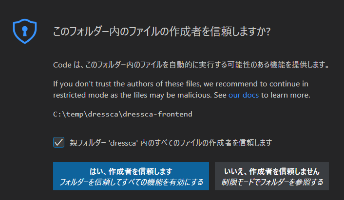
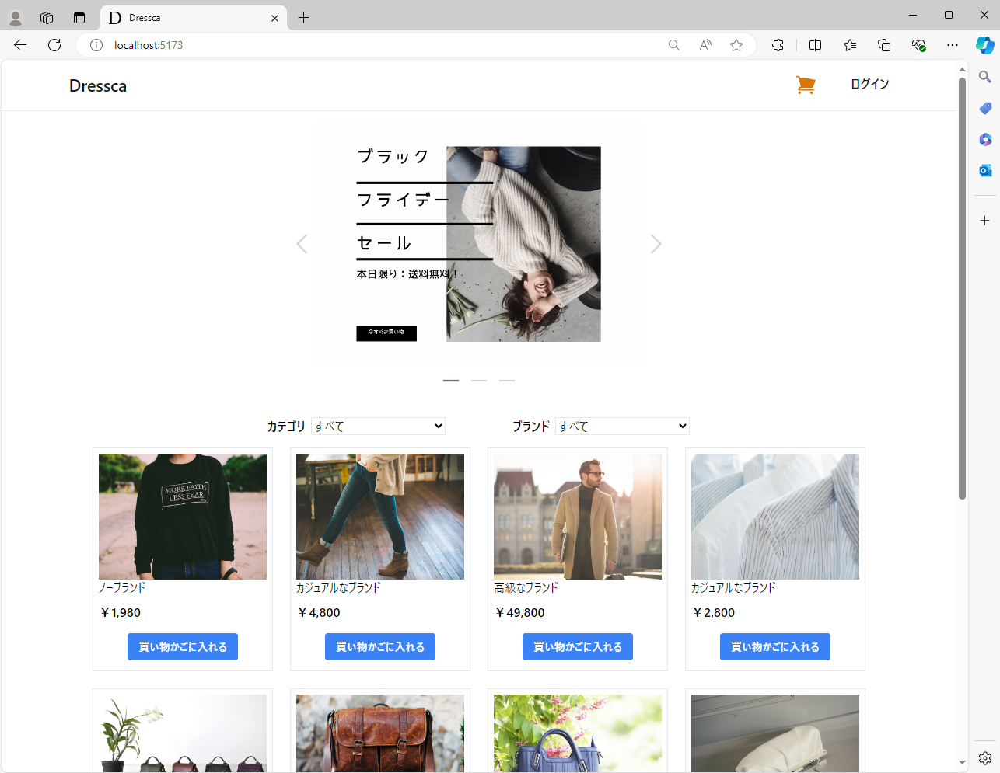

---
hide:
  - navigation
---

# Maia OSS版 にようこそ

## Maia OSS 版とは ## {: #what-is-maia-oss-version }

現代のシステム開発において標準的なベンダー中立の Java アプリケーションアーキテクチャや方式設計のための基礎資料を提供します。
Maia OSS 版の提供物は以下の通りです。

- システム形態別の標準的なアプリケーションアーキテクチャ
- 利用頻度の高い有用な OSS ライブラリ／フレームワークをベースとしたサンプルアプリケーションとその解説
- アプリケーション開発環境／プロジェクト初期構築までのチュートリアル
- 実現したい要件別のサンプルコード、および実現方式の解説

Maia OSS 版は、商用のエンタープライズシステム開発から個人開発の小規模なシステムまで、 Apache License, Version 2.0 にて無償で利用可能です。

## クイックスタート ## {: #quick-start }

Maia OSS 版で構築した Web アプリケーションのサンプルを手元で動かしながら確認いただけます。

### 共通手順 ### {: #common-operation }

フロントエンドアプリケーションとバックエンドアプリケーションの実行手順として、後述の個別手順の前に実施すべき共通の手順を説明します。

1. 以下を参照し、開発環境の構築を行ってください

    - 「[ローカル開発環境の構築](guidebooks/how-to-develop/local-environment/index.md)」

1. 以下のリンクから、サンプルアプリケーションをダウンロードしてください。

    - 「[サンプルアプリケーションのダウンロード](samples/downloads/dressca.zip)」

1. ダウンロードした zip ファイルのプロパティを開き、ファイルへのアクセスを許可 ( ブロックを解除 ) してから、任意のディレクトリに展開してください。
   以降の手順では、「dressca」ディレクトリに展開したものとして解説します。

    !!! info "展開先のディレクトリについて"
        展開先のディレクトリは、浅い階層にすることを推奨します。

### フロントエンドアプリケーションの実行手順 ### {: #frontend-operation }

1. VS Code で「dressca\\dressca-frontend」フォルダを開き、必要な拡張機能をインストールします。
「拡張機能」メニューから 「拡張機能のフィルター」>「推奨」>「ワークスペース推奨事項」にある拡張機能を全てインストールします。

    !!! info "「このフォルダー内のファイルの作成者を信頼しますか？」ダイアログが表示される場合"
        フォルダを開いた際に、下記のダイアログが表示される場合、
        「親フォルダ'dressca'内の全てのファイルの作成者を信頼します」にチェックボックスを「はい、作成者を信頼します」を押下してください。

    [{ width="600" loading=lazy }](images/trust-folder.png)

    !!! info "拡張機能のインストールが失敗する場合"
        拡張機能のインストール時にエラーが発生する場合には、
        VS Code の再起動やローカルキャッシュのクリアを試してください。

1. フロントエンドのアプリケーションを実行するためのモジュールを取得します。
コマンドプロンプト、もしくは VS Code のターミナルで、「dressca\\dressca-frontend」に移動して以下のコマンドを実行します。

    ```winbatch title="フロントエンドアプリケーションの実行に必要なパッケージのインストール"
    npm install
    ```

    !!! info "npm install が失敗した場合"
        `npm install` の途中でエラーや脆弱性情報以外の警告が出た場合、インストールに失敗している可能性があります。
        その場合は、「dressca\\dressca-frontend\\node_modules」ディレクトリを削除し、再度 `npm install` を実行してください。

1. フロントエンドのアプリケーションを実行するために、VS Code のターミナルでコマンドを実行します。
アプリケーションの実行方法は、API呼び出し時にバックエンドアプリケーションに実際にアクセスする「開発モード」と、バックエンドアプリケーションが不要でAPI呼び出しはモックを利用する「モックモード」の2種類があります。
「開発モード」で実行する場合には、後述の手順を参考にバックエンドアプリケーションを先に起動させておく必要があります。

    ```winbatch title="開発モードでのフロントエンドアプリケーションの実行"
    # 開発モードでの実行
    npm run dev
    ```

    ```winbatch title="モックモードでのフロントエンドアプリケーションの実行"
    # モックモードでの実行
    npm run mock
    ```

1. ブラウザーを開き、以下のアドレスにアクセスします。

    <http://localhost:3000>

    [{ width="600" loading=lazy }](images/dressca-top.png)

### バックエンドエンドアプリケーションの実行手順 ### {: #backend-operation }

1. VS Code で「dressca\\dressca-backend」フォルダを開き、必要な拡張機能をインストールします。
「拡張機能」メニューから 「拡張機能のフィルター」>「推奨」>「ワークスペース推奨事項」にある拡張機能を全てインストールします。

1. VS Code のターミナルで、カレントフォルダを「dressca\\dressca-backend」にして以下のコマンドを実行してビルドします。

    ```winbatch title="バックエンドアプリケーションのビルド"
    ./gradlew build
    ```

1. VS Code のエクスプローラーの「SPRING BOOT DASHBOARD」から「web」という名前のアプリケーションを実行します

1. 以下のアドレスで、サンプルアプリケーションの API にアクセスできます。

    <http://localhost:8080>

    フロントエンドアプリケーションや API クライアントツールを利用してアクセスしてください。

--8<-- "includes/abbreviations.md"
