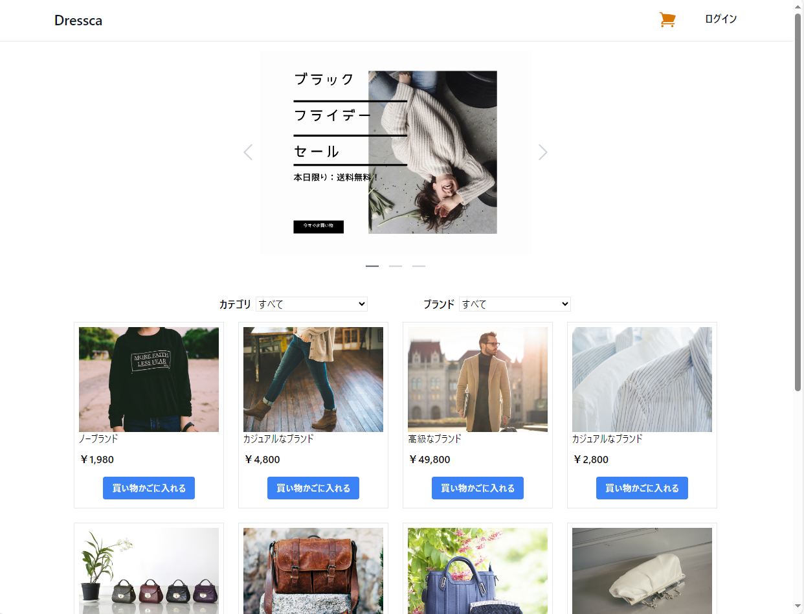
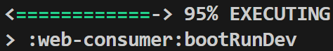

---
hide:
  - navigation
title: AlesInfiny Maia OSS Edition
description: AlesInfiny Maia OSS Edition では、 Java アプリケーション アーキテクチャや方式設計の基礎資料を提供します。
---

# AlesInfiny Maia OSS Edition にようこそ {#top}

## AlesInfiny Maia OSS Edition とは {#what-is-alesinfiny-maia}

AlesInfiny Maia OSS Edition （以降、 AlesInfiny Maia）では、 Java アプリケーションの一般的なアーキテクチャや方式設計のためのドキュメントおよびサンプルアプリケーションを提供します。
AlesInfiny Maia の提供物は以下の通りです。

- システム形態別の標準的なアプリケーションアーキテクチャ
- 利用頻度の高い有用な OSS ライブラリ／フレームワークを基盤としたサンプルアプリケーションおよびその解説
- アプリケーション開発環境／プロジェクト初期構築までのチュートリアル
- 実現したい要件別のサンプルコード、および実現方式の解説

AlesInfiny Maia は、クリエイティブ・コモンズ表示 4.0 国際ライセンスおよび Apache License, Version 2.0 にて使用可能です。
商用のエンタープライズシステム開発から個人開発の小規模なシステムまで、ライセンスの条項に従う限り、個人、商用とも無料で使用できます。
ライセンスについての詳細は「[利用規約 - ライセンス](about-maia/terms.md#license)」を参照してください。

## クイックスタート {#quick-start}

AlesInfiny Maia で構築した Web アプリケーションのサンプルを手元で動かしながら確認いただけます。

### 共通手順 {#common-operation}

フロントエンドアプリケーションとバックエンドアプリケーションの実行手順として、後述の個別手順の前に行う共通の手順を説明します。

1. 以下を参照し、開発環境を構築してください

    - 「[ローカル開発環境の構築](guidebooks/how-to-develop/local-environment/index.md)」

1. 以下のリンクから、サンプルアプリケーションをダウンロードしてください。

    - 「[サンプルアプリケーションのダウンロード](samples/downloads/dressca.zip)」

1. ダウンロードした zip ファイルのプロパティを開き、ファイルへのアクセスを許可 ( ブロックを解除 ) してから、任意のフォルダーに展開してください。
   以降の手順では、「dressca」フォルダーに展開したものとして解説します。

    !!! info "展開先のフォルダーについて"
        展開先のフォルダーは、浅い階層にすることを推奨します。

### フロントエンドアプリケーションの実行手順 {#frontend-operation}

1. VS Code で「ファイルでワークスペースを開く」から、「dressca\\dressca-frontend\\dressca-frontend.code-workspace」を開き、必要な拡張機能をインストールします。
「拡張機能」メニューから 「拡張機能のフィルター」>「推奨」>「ワークスペース推奨事項」にある拡張機能を全てインストールします。

    !!! info "「このフォルダー内のファイルの作成者を信頼しますか？」ダイアログが表示される場合"
        [{ width="300" loading=lazy align=right }](images/trust-folder.png)

        フォルダーを開いた際に、図のダイアログが表示される場合、
        「親フォルダー 'dressca' 内の全てのファイルの作成者を信頼します」のチェックボックスにチェックを入れ、「はい、作成者を信頼します」を押下してください。

    !!! info "拡張機能のインストールが失敗する場合"
        拡張機能のインストール時にエラーが発生する場合には、
        VS Code の再起動やローカルキャッシュのクリアを試してください。

1. フロントエンドのアプリケーションを実行するためのモジュールを取得します。
 VS Code のターミナルで、「dressca\\dressca-frontend」にいることを確認し、以下のコマンドを実行します。

    ```shell title="フロントエンドアプリケーションの実行に必要なパッケージのインストール"
    npm ci
    ```

    !!! info "npm ci が失敗した場合"
        `npm ci` の途中でエラーや脆弱性情報以外の警告が出た場合、インストールに失敗している可能性があります。
        その場合は、「dressca\\dressca-frontend\\node_modules」、
        「dressca\\dressca-frontend\\consumer\\node_modules」、
        「dressca\\dressca-frontend\\admin\\node_modules」ディレクトリをそれぞれ削除し、再度 `npm ci` を実行してください。

1. フロントエンドのアプリケーションを実行します。
VS Code のターミナルで、「dressca\\dressca-frontend」にいることを確認し、以下のコマンドを実行してください。
アプリケーションの実行方法は、 API 呼び出し時にバックエンドアプリケーションへ実際にアクセスする「開発モード」と、 API 呼び出し時にモックを利用する「モックモード」の 2 種類があります。
「開発モード」で実行する場合には、後述の手順を参照してバックエンドアプリケーションを先に起動させておく必要があります。

    ```shell title="開発モードでのフロントエンドアプリケーションの実行"
    # 開発モードでの実行
    npm run dev:consumer
    ```

    ```shell title="モックモードでのフロントエンドアプリケーションの実行"
    # モックモードでの実行
    npm run mock:consumer
    ```

1. ブラウザーを開き、以下のアドレスにアクセスします。

    <http://localhost:5173>

    [{ width="600" loading=lazy }](images/dressca-top.png)

### バックエンドエンドアプリケーションの実行手順 {#backend-operation}

1. VS Code で「dressca\\dressca-backend」フォルダーを開き、必要な拡張機能をインストールします。
「拡張機能」メニューから 「拡張機能のフィルター」>「推奨」>「ワークスペース推奨事項」にある拡張機能を全てインストールします。
インストール後、拡張機能の初期化処理が実行されます。
初期化処理の状態を VS Code のステータスバーで確認し、完了後次の手順に進んでください。

    { width="800" loading=lazy }
    { width="800" loading=lazy }

1. VS Code のアクティビティーバーにある「 Gradle 」をクリックし、サイドバーの「 GRADLE PROJECTS 」タブから以下のタスクを実行します。

    dressca-backend > Tasks > build > build

1. 前手順と同様に、サイドバーの「 GRADLE PROJECTS 」タブから以下のタスクを実行します。

    web-consumer > Tasks > application > bootRunDev

    !!! tip "bootRunDev タスクのパーセンテージについて"

        { width="300" loading=lazy align=right }
        
        bootRunDev タスクはサーバーとして待機するループ処理を行うため、図のようにパーセンテージが 100% になりません。
        以降の手順で API にアクセスできれば、正常に起動できています。

1. 以下のアドレスで、サンプルアプリケーションの API にアクセスできます。

    <http://localhost:8080>

    フロントエンドアプリケーションや API クライアントツールを利用してアクセスしてください。
    サンプルアプリケーションが提供する API の仕様については、以下のアドレスから参照できます。

    <http://localhost:8080/swagger-ui.html>
