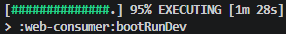
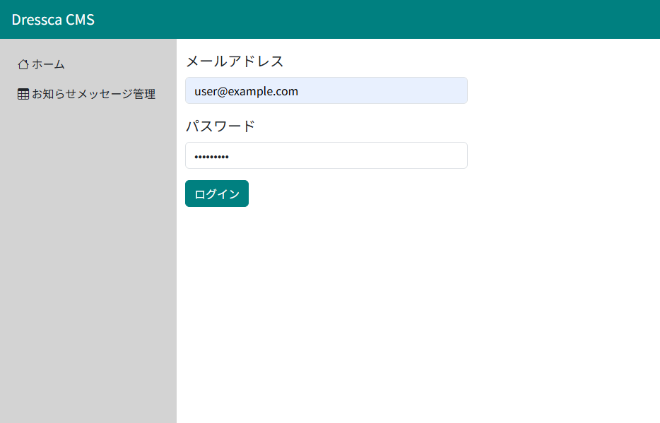
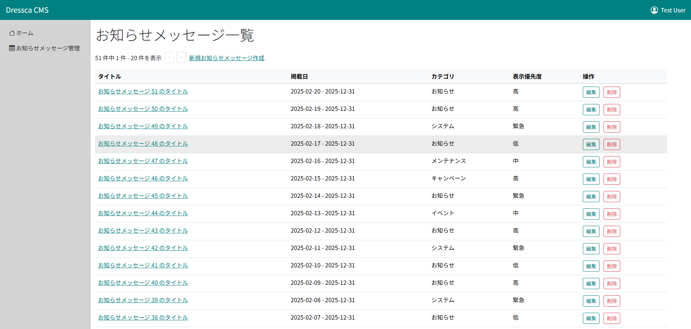

# Dressca-CMS {#top}

## 概要 {#overview}

Dressca-CMS は、 Spring Framework / Spring Boot をベースとした CMS システムです。
画面に表示される HTML は Thymeleaf によりサーバーサイドでレンダリングされており、各操作は HTTP リクエストに基づくページ遷移型の画面構成として実装されています。
サンプルアプリケーションでは、ログイン機能に加え、認証済みユーザーがお知らせメッセージを管理するための一連の機能（一覧、登録、更新、削除）が実装されています。

## クイックスタート {#quick-start}

1. 以下を参照し、開発環境を構築してください。

    - 「[ローカル開発環境の構築](../../guidebooks/how-to-develop/ssr/local-environment/index.md)」

1. 以下のリンクから、サンプルアプリケーションをダウンロードしてください。

    - 「[サンプルアプリケーションのダウンロード](../downloads/dressca-cms.zip)」

1. ダウンロードした zip ファイルのプロパティを開き、ファイルへのアクセスを許可 ( ブロックを解除 ) してから、任意のフォルダーに展開してください。
   以降の手順では、「dressca-cms」フォルダーに展開したものとして解説します。

    !!! info "展開先のフォルダーについて"
        展開先のフォルダーは、浅い階層にすることを推奨します。

1. VS Code で「dressca-cms」フォルダーを開き、必要な拡張機能をインストールします。
「拡張機能」メニューから 「拡張機能のフィルター」>「推奨」>「ワークスペース推奨事項」にある拡張機能を全てインストールします。
インストール後、拡張機能の初期化処理が実行されます。
初期化処理の状態を VS Code のステータスバーで確認し、完了後次の手順に進んでください。

    { width="800" loading=lazy }
    { width="800" loading=lazy }

1. VS Code のアクティビティーバーにある「 Gradle 」をクリックし、サイドバーの「 GRADLE PROJECTS 」タブから以下のタスクを実行します。

    dressca-cms > Tasks > build > build

1. 前手順と同様に、サイドバーの「 GRADLE PROJECTS 」タブから以下のタスクを実行します。

    dressca-cms > Tasks > application > bootRunDev

    !!! tip "bootRunDev タスクのパーセンテージについて"

        { width="300" loading=lazy align=right }
        
        bootRunDev タスクはサーバーとして待機するループ処理を行うため、図のようにパーセンテージが 100% になりません。
        以降の手順で API にアクセスできれば、正常に起動できています。

1. 以下のアドレスで、サンプルアプリケーションにアクセスできます。

    <http://localhost:8082>

1. ログイン画面が表示されたら、開発環境用に設定されているメールアドレスとパスワードを入力して「ログイン」ボタンを押下してください。メールアドレスは [user@example.com] 、パスワードは [P@ssw0rd1] です。

    [{ width="600" loading=lazy }](../../images/samples/dressca-cms-login.png)

1. ログインに成功したら、トップ画面に遷移します。左メニューから「お知らせメッセージ管理」を押下してください。お知らせメッセージ管理画面が表示されます。

     [{ width="800" loading=lazy }](../../images/samples/dressca-cms-announcements.png)
