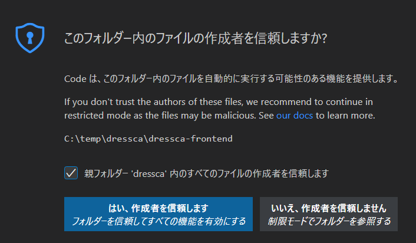
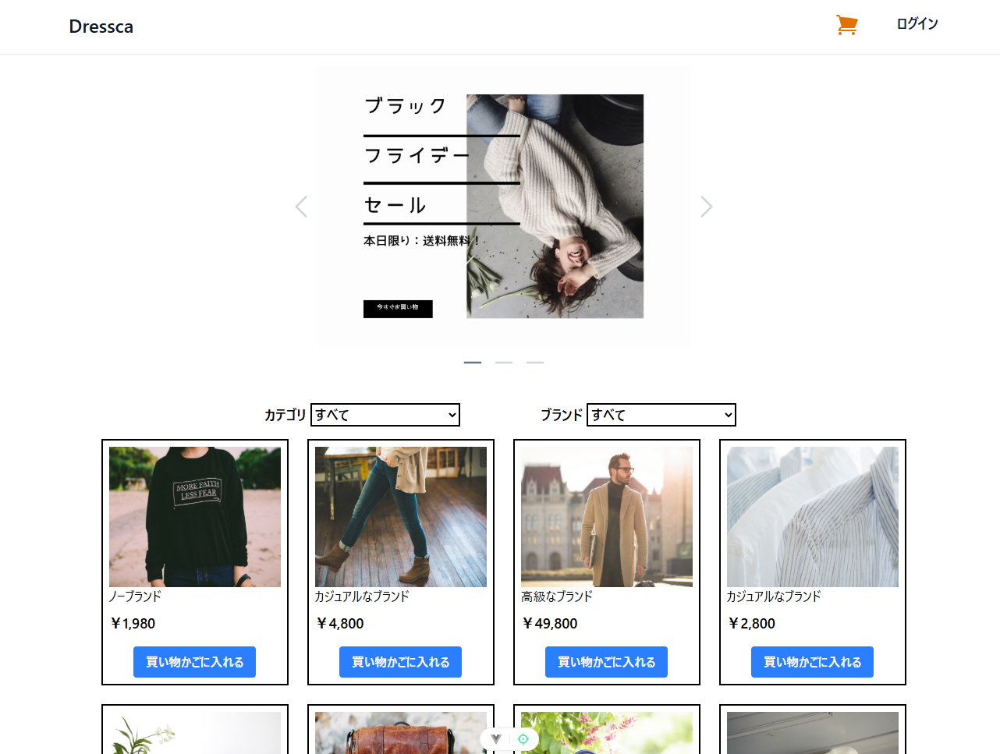
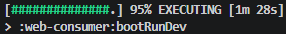
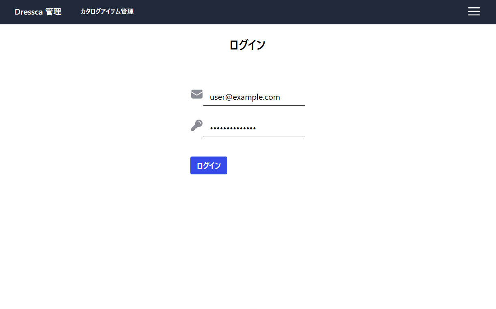
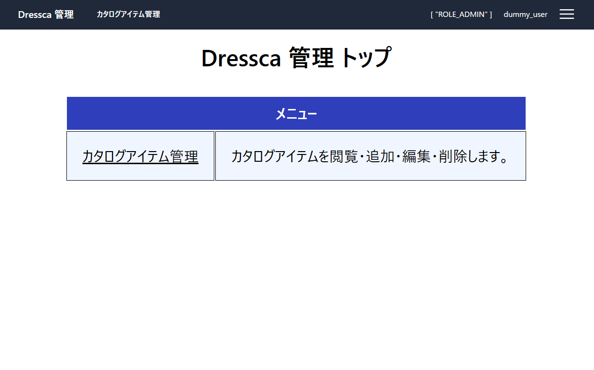

# Dressca {#top}

## 概要 {#overview}

Dressca は、 Spring Framework / Spring Boot を用いて構築されたバックエンドアプリケーションと、 Vue.js ベースのフロントエンドアプリケーションから構成される Web アプリケーションです。
クライアントサイドで HTML をレンダリングすることで、快適で高品質なユーザー体験を実現しています。
バックエンドとフロントエンドは、 OpenAPI により公開された API 仕様を介して連携しています。
サンプルアプリケーションでは、 EC サイト利用者向けアプリケーション（以下、 Consumer）と管理者向けアプリケーション（以下、 Admin）の 2 種類のアプリケーションを実装しています。

## アプリケーション起動の準備 {#application-startup-preparation}

1. 以下を参照し、開発環境を構築してください

    - 「[ローカル開発環境の構築](../../guidebooks/how-to-develop/csr/local-environment/index.md)」

1. 以下のリンクから、サンプルアプリケーションをダウンロードしてください。

    - 「[サンプルアプリケーションのダウンロード](../downloads/dressca.zip)」
    - 「[サンプルアプリケーションのダウンロード(BIPROGYグループ向け) :material-open-in-new:](https://forms.office.com/r/eFY95qfNNf){ target=_blank }」

1. ダウンロードした zip ファイルのプロパティを開き、ファイルへのアクセスを許可 ( ブロックを解除 ) してから、任意のフォルダーに展開してください。
   以降の手順では、「dressca」フォルダーに展開したものとして解説します。

    !!! info "展開先のフォルダーについて"
        展開先のフォルダーは、浅い階層にすることを推奨します。

1. VS Code で「ファイルでワークスペースを開く」から、「dressca\\dressca-frontend\\dressca-frontend.code-workspace」を開き、必要な拡張機能をインストールします。
「拡張機能」メニューから 「拡張機能のフィルター」>「推奨」>「ワークスペース推奨事項」にある拡張機能を全てインストールします。

    !!! info "「このフォルダー内のファイルの作成者を信頼しますか？」ダイアログが表示される場合"
        { width="300" loading=lazy align=right }

        フォルダーを開いた際に、図のダイアログが表示される場合、
        「親フォルダー 'dressca' 内の全てのファイルの作成者を信頼します」のチェックボックスにチェックを入れ、「はい、作成者を信頼します」を押下してください。

    !!! info "拡張機能のインストールが失敗する場合"
        拡張機能のインストール時にエラーが発生する場合には、
        VS Code の再起動やローカルキャッシュのクリアを試してください。

1. フロントエンドのアプリケーションを実行するためのモジュールを取得します。
 VS Code のターミナルで、「dressca\\dressca-frontend」にいることを確認し、以下のコマンドを実行します。

    ```shell title="フロントエンドアプリケーションの実行に必要なパッケージのインストール"
    npm ci
    ```

    !!! info "npm ci が失敗した場合"
        `npm ci` の途中でエラーや脆弱性情報以外の警告が出た場合、インストールに失敗している可能性があります。
        その場合は、「dressca\\dressca-frontend\\node_modules」、
        「dressca\\dressca-frontend\\consumer\\node_modules」、
        「dressca\\dressca-frontend\\admin\\node_modules」ディレクトリをそれぞれ削除し、再度 `npm ci` を実行してください。

1. VS Code で「dressca\\dressca-backend」フォルダーを開き、必要な拡張機能をインストールします。
「拡張機能」メニューから 「拡張機能のフィルター」>「推奨」>「ワークスペース推奨事項」にある拡張機能を全てインストールします。
インストール後、拡張機能の初期化処理が実行されます。
初期化処理の状態を VS Code のステータスバーで確認し、完了後次の手順に進んでください。

    { width="800" loading=lazy }
    { width="800" loading=lazy }

1. VS Code のアクティビティーバーにある「 Gradle 」をクリックし、サイドバーの「 GRADLE PROJECTS 」タブから以下のタスクを実行します。

    dressca-backend > Tasks > build > build

1. アプリケーション起動の準備は完了です。[Consumer アプリケーションの起動](#start-consumer-application)、[Admin アプリケーションの起動](#start-admin-application) を参照し、アプリケーションを起動してください。

## Consumer アプリケーションの起動 {#start-consumer-application}

### フロントエンドアプリケーションの実行手順 {#consumer-frontend-operation}

1. フロントエンドのアプリケーションを実行します。
VS Code のターミナルで、「dressca\\dressca-frontend」にいることを確認し、以下のコマンドを実行してください。
アプリケーションの実行方法は、 API 呼び出し時にバックエンドアプリケーションへ実際にアクセスする「開発モード」と、 API 呼び出し時にモックを利用する「モックモード」の 2 種類があります。
「開発モード」で実行する場合には、後述の手順を参照してバックエンドアプリケーションを先に起動させておく必要があります。

    ```shell title="開発モードでのフロントエンドアプリケーションの実行"
    # 開発モードでの実行
    npm run dev:consumer
    ```

    ```shell title="モックモードでのフロントエンドアプリケーションの実行"
    # モックモードでの実行
    npm run mock:consumer
    ```

1. ブラウザーを開き、以下のアドレスにアクセスします。

    <http://localhost:5173>

    { width="600" loading=lazy }

1. サンプルアプリケーションに実装された機能を確認できます。[Consumer アプリケーションの機能](#consumer-application-features) を参照してください。

### バックエンドアプリケーションの実行手順 {#consumer-backend-operation}

1. VS Code のアクティビティーバーにある「 Gradle 」をクリックし、サイドバーの「 GRADLE PROJECTS 」タブから以下のタスクを実行します。

    web-consumer > Tasks > application > bootRunDev

    !!! tip "bootRunDev タスクのパーセンテージについて"

        { width="300" loading=lazy align=right }
        
        bootRunDev タスクはサーバーとして待機するループ処理を行うため、図のようにパーセンテージが 100% になりません。
        以降の手順で API にアクセスできれば、正常に起動できています。

1. 以下のアドレスで、サンプルアプリケーションの API にアクセスできます。

    <http://localhost:8080>

    フロントエンドアプリケーションや API クライアントツールを利用してアクセスしてください。
    サンプルアプリケーションが提供する API の仕様については、以下のアドレスから参照できます。

    <http://localhost:8080/swagger-ui.html>

### Consumer アプリケーションの機能 {#consumer-application-features}

Consumer アプリケーションに実装された機能の確認手順を示します。

#### カタログアイテムを注文する {#order-catalog-item}

{ width="1200" loading=lazy }
{ width="1200" loading=lazy }

1. 上記の [Consumer アプリケーションの起動](#start-consumer-application) に従って、 Consumer アプリケーションを実行します。

1. 任意のアイテムについて、「買い物かごに入れる」ボタンを押下します。買い物かご画面に遷移し、選択したアイテムが買い物かごに入っていることを確認してください。

1. 「レジへ進む」ボタンを押下すると、ログイン画面へ遷移します。ログインフォームにそれぞれ [メールアドレス形式の文字列] と [任意の 1 文字以上の文字列] を入力し、「ログイン」ボタンを押下してください。

1. 注文確認画面へ遷移します。「注文を確定する」ボタンを押下し、注文完了画面へ遷移することを確認してください。

## Admin アプリケーションの起動 {#start-admin-application}

### フロントエンドアプリケーションの実行手順 {#admin-frontend-operation}

1. フロントエンドのアプリケーションを実行します。
VS Code のターミナルで、「dressca\\dressca-frontend」にいることを確認し、以下のコマンドを実行してください。
アプリケーションの実行方法は、 API 呼び出し時にバックエンドアプリケーションへ実際にアクセスする「開発モード」と、 API 呼び出し時にモックを利用する「モックモード」の 2 種類があります。
「開発モード」で実行する場合には、後述の手順を参照してバックエンドアプリケーションを先に起動させておく必要があります。

    ```shell title="開発モードでのフロントエンドアプリケーションの実行"
    # 開発モードでの実行
    npm run dev:admin
    ```

    ```shell title="モックモードでのフロントエンドアプリケーションの実行"
    # モックモードでの実行
    npm run mock:admin
    ```

1. ブラウザーを開き、以下のアドレスにアクセスします。

    <http://localhost:6173>

    { width="600" loading=lazy }

1. ログイン画面が表示されたら、ログインフォームにそれぞれ [メールアドレス形式の文字列] と [任意の 1 文字以上の文字列] を入力し、「ログイン」ボタンを押下してください。

1. ホーム画面へ遷移し、メニューが表示されることを確認してください。

    { width="600" loading=lazy }

1. サンプルアプリケーションに実装された機能を確認できます。[Admin アプリケーションの機能](#admin-application-features) を参照してください。

### バックエンドアプリケーションの実行手順 {#admin-backend-operation}

1. VS Code のアクティビティーバーにある「 Gradle 」をクリックし、サイドバーの「 GRADLE PROJECTS 」タブから以下のタスクを実行します。

    web-admin > Tasks > application > bootRunDev

1. 以下のアドレスで、サンプルアプリケーションの API にアクセスできます。

    <http://localhost:8081>

    フロントエンドアプリケーションや API クライアントツールを利用してアクセスしてください。
    サンプルアプリケーションが提供する API の仕様については、以下のアドレスから参照できます。

    <http://localhost:8081/swagger-ui.html>

### Admin アプリケーションの機能 {#admin-application-features}

Admin アプリケーションに実装された機能の確認手順を示します。

#### カタログアイテムを編集する {#edit-catalog-item}

{ width="1200" loading=lazy }
{ width="1200" loading=lazy }

<!-- textlint-disable @textlint-ja/no-synonyms -->
<!--「一覧画面」の「一」に漢字を用いるため -->
1. 上記の [Admin アプリケーションの起動](#start-admin-application) に従って Admin アプリケーションを実行し、ログインしてホーム画面へ遷移します。

1. 「カタログアイテム管理」ボタンを押下し、カタログアイテム一覧画面へ遷移します。

1. 「アイテム ID」が 1 のアイテムの行の「編集」ボタンを押下し、カタログアイテム編集画面へ遷移します。

1. 「変更後」フォームに任意のアイテムの情報を入力してください。このとき、入力できるアイテムの情報にはバリデーションが実装されています。エラーメッセージが表示されたら、エラーメッセージに従って入力内容を修正してください。入力が完了したら、「更新」ボタンを押下します。

1. 確認モーダルが表示されます。「はい」を押下して実行します。

1. 更新に成功したら、通知モーダルが表示されます。「はい」を押下します。

1. 「変更前」のアイテムの情報が、先ほど入力した情報で更新されていることを確認してください。

1. ヘッダーメニューの「カタログアイテム管理」ボタンを押下し、カタログアイテム一覧画面へ遷移します。「アイテム ID」が 1 のアイテムの情報が、先ほど入力した情報で更新されていることを確認してください。
<!-- textlint-enable @textlint-ja/no-synonyms -->
